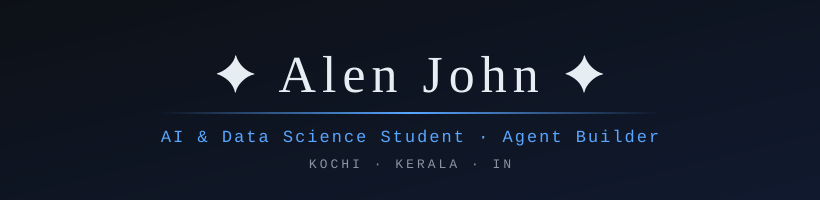
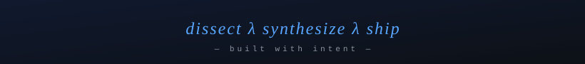

<!-- ═══════════════════════════════════════════════════════════════ -->
<!--  AL E N  J O H N  ·  profile · handcrafted, not templated       -->
<!-- ═══════════════════════════════════════════════════════════════ -->



<div align="center">

**Building agents that read the market. Learning everything else on the side.**


</div>

<br>

<div align="center">

### 🧭 *what this profile is about*

> Most profiles list skills. This one shows a **direction** — I'm assembling competence across AI, finance, strategy, math, and craft. One system at a time.

</div>

<br>

## 🎯 The Direction

```yaml
who:
  role: "AI & Data Science student"
  base: "Kochi, Kerala, India"

now_building:
  flagship: "Chrimatos — multi-agent due-diligence pipeline for US equities"
  stack: [LangGraph, Gemini, Alpha Vantage, FastAPI, caching + audit trails]

now_learning:            # 13-week sprints, weekly checkpoints
  - probability & statistics
  - market mechanics & portfolio theory
  - music theory (piano + voice)

next_up:
  - automation pipelines that reclaim real hours
  - design fundamentals
  - economics (micro → macro)
```

<br>

## ⚙️ Core Stack

<div align="center">

| | | |
|---|---|---|
| `Python` | `TypeScript` | `JavaScript` |
| `FastAPI` | `Node.js` | `React` |

</div>

<br>

## 🚀 Selected Builds

<div align="center">

| | Project | The one-liner |
|---|---------|---------------|
| 🧠 | **[Chrimatos](https://github.com/CrescentState/Financial-Risk-Analyser)** | 4-agent AI pipeline → structured due-diligence brief for any US ticker, with audit trails |
| 📊 | **[RTO Risk Scorer](https://github.com/CrescentState/RTO-Risk-Scorer)** | Deterministic, explainable risk scoring — no black box |
| 🔎 | **[Knowledge Base API](https://github.com/CrescentState/Knowledge-base-api)** | Retrieval backend that serves structured knowledge for Q&A |
| 📰 | **[Sentiment Analysis](https://github.com/CrescentState/Sentiment-Analysis)** | News sentiment extraction with structured LLM output |

🔗 **[Chrimatos is live →](https://financial-risk-analyser.onrender.com/)**

</div>

<br>

<div align="center">


</div>

<br>

## 📬 Reach Me

<div align="center">

<a href="mailto:alenjohn6573@gmail.com"></a>&nbsp;&nbsp;
<a href="https://www.linkedin.com/in/alenjohn-d/"></a>&nbsp;&nbsp;
<a href="https://github.com/CrescentState"></a>

</div>

<br>

